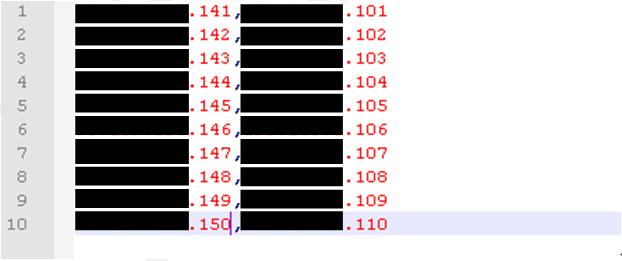
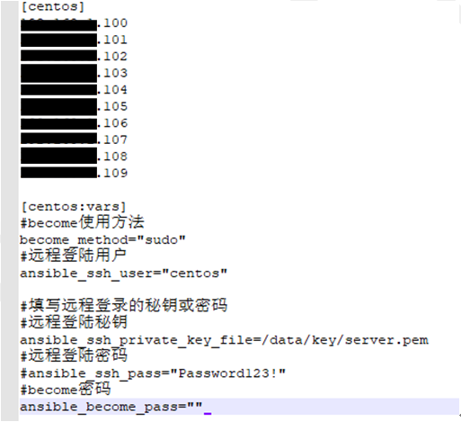
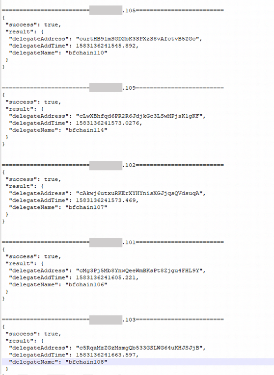

# 节点部署

本章将介绍如何进行节点的部署，包括节点部署、链的部署等。

## 部署方式

### 单节点部署

按照下列步骤即可部署单节点：

1. 在单节点上安装生物链林数据中心版节点程序(BCF.exe)；
   
   按照本文第3章的操作说明完成BCF.exe安装配置，配置成功之后双击BCF.exe可运行节点。若提示未经授权，则根据[\<节点授权申请\>](/01.guide/01.install.html#节点授权申请)，完成节点授权后即可运行节点。

2. 切换节点网络环境：请参考[\<配置网络环境\>](/01.guide/01.install.html#配置网络环境)；

3. 切换节点运行的链：请参考[\<配置节点运行的链\>](/01.guide/01.install.html#配置节点运行的链)；

4. 绑定地址：请参考[\<绑定地址\>](/01.guide/01.install.html#绑定地址)。

以上操作成功之后，就能实现单节点部署。

### 多节点部署

下文将以部署三个节点为例，说明如何在多台节点上部署同一条链的生物链林数据中心版节点程序(BCF.exe)。

#### 安装

在三个不同节点（节点IP分别为`192.168.0.1`，`192.168.0.2`，`192.168.0.3`）上按照手册中的安装步骤分别安装BCF.exe。安装成功之后双击BCF.exe可运行节点。若提示未经授权，则根据[\<节点申请授权\>](/01.guide/01.install.html#节点授权申请)，完成节点授权后即可运行节点。

#### 配置

多节点之间要实现节点同步，要配置节点同步IP列表，在节点启动后会自动与列表中的节点连接。具体操作方式如下：

1. 切换节点网络环境：请参考[\<配置网络环境\>](/01.guide/01.install.html#配置网络环境)；

2. 切换节点运行的链：请参考[\<配置节点运行的链\>](/01.guide/01.install.html#配置节点运行的链)；

3. 添加待同步的节点IP(假设用户配置的是正式网络)：
   
   配置文件路径：`/安装目录/conf/bft-config-mainnet.json`(若用户配置的是测试网络，则修改`bft-config-testnet.json`文件)。在peers的list中配置需要连接的节点ip，这样在运行时会自动与该节点同步。
   
   例如本节点(`192.168.0.1`)需要同步的其他2个节点（`192.168.0.2`，`192.168.0.3`），可按照下图进行配置。
   
   

4. 绑定地址：请参考[\<绑定地址\>](/01.guide/01.install.html#绑定地址)。

> 注1：部署三个节点，所以每轮至少需要3个区块，至少这里需要设置3个受托人。我们推荐每轮57个区块，114个受托人；

> 注2：创世块可以由一台节点创建，然后将创世块拷贝到节点安装目录的`genesisInfos`文件夹下，并且按照上述步骤修改配置文件方可运行；

> 注3：运行非BFChain的链需要进行区块链授权，详情请见\<[区块链授权](/01.guide/01.install.html#区块链授权申请)\>。

#### 运行

完成以上配置后，即可实现多节点部署。

### 大规模部署

#### 节点服务器环境准备

以`centos`系统为例的批量部署10台节点。需要先准备一台管理服务器，通过该管理服务器下发配置命令至各节点服务器进行配置操作。

1. 配置管理服务器（管理服务器能ssh登录至各节点服务器）：
   
   1. 创建相关目录：
      
      ```shell
       mkdir -p /data/ansible_dir
      
       mkdir -p /data/key
      
       mkdir -p /data/release
      
       mkdir -p /data/scripts
      ```
   
   2. 安装自动化运维工具aisible：
      ```shell
       yum –y install ansible
      ```
   
   3. 配置python运行环境
      ```shell
       yum -y install python-pip
      
       pip install paramiko multiprocessing
      ```
   
   4. 上传节点服务器配置脚本到管理服务器目录/data/ansible_dir并解压：
      ```shell
       unzip os_initial.zip
      ```
      
      > 注：服务器配置脚本见文档附件中的os_initial.zip
   
   5. 生成秘钥对：
      ```shell
       ssh-keygen -t rsa
      ```
      
      
   
   6. 将公钥id_rsa.pub黏贴至：
      
      ` /data/ansible_dir/os_initial/roles/set_sshd/files/public_keys/ops`
      
      ```shell
      mv id_rsa.pub /data/ansible_dir/os_initial/roles/set_sshd/files/public_keys/ops/id_rsa.pub
      ```
   
   7. 将私钥文件拷贝至目录 `/data/key/ mv id_rsa /data/key/id_rsa`
   
   8. 修改文档附件中的cmd.py中的username、port、key为实际值，分别表示登录节点服务器的用户名、端口，以及所用的私钥的路径,并上传至管理机目录/data/scripts/中
   
   9. 创建文件`/data/scripts/ip.txt`（节点服务器公网,私网ip）如下：
      
      
   
   10. 创建管理服务器对各节点服务器ssh登录的信息文件`/data/ansible_dir/bfchainnodehosts`：
   
   示例含义如下：
   
   | [bfchainnode]                | 组名                    |
   |:---------------------------- | --------------------- |
   | `ansible_ssh_port`             | 管理机连接节点的ssh登录端口       |
   | `ansible_ssh_user`             | 登录管理机连接节点的用户名         |
   | `ansible_become`               | 激活权限提升(有时候需要使用root用户) |
   | `ansible_become_user`          | 设置为具有所需权限的用户          |
   | `ansible_become_pass`          | 这个用户的密码               |
   | `ansible_ssh_private_key_file` | 私钥的路径                 |
   
   

2. 配置节点服务器
   
   1. 修改`/data/ansible_dir/os_initial/default.hosts`文件，,配置节点服务器ip及登录方式：
   
      
   
   2. 运行脚本配置节点服务器运行环境：
   
   ```bash
   ansible-playbook /data/ansible_dir/os_initial/default.hosts/os_initial.yml -i
   /data/ansible_dir/os_initial/default.hosts
   ```

#### 节点服务器部署BFChain包

1. 将已经安装好的节点压缩成.zip压缩包。

2. 上传发布包BFChain.zip至管理服务器目录：`/data/release/bfchain.zip`

3. 分发BFChain发布包至各节点服务器：
   
   ```
   ansible bfchainnode -i /data/ansible_dir/bfchainnodehosts -m copy -a
   "src=/data/release/bfchain.zip dest=/data/release/bfchain.zip"
   ```

4. 运行节点服务器部署脚本：
   
   ```python
   python /data/scripts/cmd.py "sudo sh /data/scripts/update_bfchain.sh"
   ```

5. 批量启动节点
   
   ```
   ansible bfchainnode -m shell -i /data/ansible_dir/bfchainnodehosts -a
   'systemctl start supervisord '
   ```

#### 批量管理/执行节点命令

通过调用`ansible`批量在节点执行`command`命令。如下：

```
ansible bfchainnode -m shell -i /data/ansible_dir/bfchainnodehosts -a 'command'
```

> 注: `command`为要执行的命令

例如批量执行 `–glb`，命令输入如下操作即可获得。

### 多条链部署

用户如果想在某节点上部署生物链林数据中心版多条链，例如用户想部署BFChain和另一条链FINChain，可按照下列操作步骤执行：

1. 用户下载安装生物链林数据中心版(BCF)，并按照上文\<[单节点部署](/01.guide/02.deploy.html#单节点部署)\>方式修改配置文件，启动则部署BFChain成功。

2. 根据\<[配置节点运行的链](/01.guide/01.install.html#配置节点运行的链)\>，切换为FINChain的创世块运行，并检查相应的配置文件。配置文件路径：`/安装目录/conf/“链名”-config-“网络类型”.json`。
   
   例如：链名= “fin”, 网络类型 = `mainnet`(正式网络: `mainnet`; 测试网络:`testnet`)。则FINChain的正式网络路径如下：`/安装目录/conf/fin-config-mainnet.json`。

3. 用户如果部署另外的链，可按照步骤2进行操作。

## 组网模式

### 公有链部署

1. 若想运行BFChain公有链节点的正式网络，则按照\<[单节点部署](/01.guide/02.deploy.html#单节点部署)\>步骤，将配置文件`/安装目录/conf/base-config.json`中的参数：
   
   1. “`isGenesisBlockProvidedExternally`”设置为`false`
   
   2. “`bnid`”设置为`b`

2. 若想运行的是BFChain公有链节点的测试网络，则
   
   1. “`isGenesisBlockProvidedExternally`”设置为`false`
   
   2. “`bnid`”设置为`c`

### 联盟链部署

1. 需要联系生物链林BCF团队申请联盟链的创世块。

2. 联盟链的准入权限在部署网络时管理，区块链上不管理接入权限。

3. 按照\<[单节点部署](/01.guide/02.deploy.html#单节点部署)\>步骤使用联盟链创世块部署节点。

4. 按照\<[多节点部署](/01.guide/02.deploy.html#多节点部署)\>配置节点连接的IP，可实现各节点的同步。

5. 机构之间独自管理各个节点的\<[配置数据库的用户名和密码](/01.guide/01.install.html#配置数据库的用户名和密码)\>

### 私有链部署

1. 需要联系生物链林BCF团队申请私有链的创世块。

2. 按照\<[单节点部署](/01.guide/02.deploy.html#单节点部署)\>步骤使用私有链创世块部署节点，这样运行节点时则可以启动私有链。

3. 按照\<[多节点部署](/01.guide/02.deploy.html#多节点部署)\>配置节点连接的IP，可实现各节点的同步。

4. 在私有链上重置区块链。见\<[区块链数据重置](/01.guide/03.faq.html#区块链数据重置)\>。如果有多个节点，需要在每个节点上都重置。

## 启停区块

### 绑定单个地址

详情请参考[\<绑定地址\>](/01.guide/01.install.html#绑定地址)。

### 批量绑定地址

1. 参考\<[节点服务器环境准备](/01.guide/02.deploy.html#节点服务器环境准备)\>，将bandkeyhosts文件上传至管理服务器的/data/ansible_dir/bandkeyhosts参照下列表格配置相应的值。

| bfchainnode001                              | 别名                     |
| ------------------------------------------- | ---------------------- |
| `ansible_ssh_port=18899`                      | 节点登录ssh端口号             |
| `ansible_ssh_host=192.168.0.1`                | 节点可ssh登陆的内网ip          |
| `ansible_ssh_user=user1`                      | 节点以该用户ssh登录            |
| `ansible_become=true`                        | 是否启用 sudo 权限           |
| `ansible_become_user=root`                    | 切换sudo后执行命令使用的用户       |
| `ansible_become_pass=''`                      | 切换sudo使用的密码（单引号里面输入密码） |
| `ansible_ssh_private_key_file=/data/key/key1` | ssh登录使用的秘钥文件           |
| `secretkey`                                   | 节点绑定的委托人秘钥（单引号里面输入秘钥）  |

2. 在管理机中输入如下命令，可批量绑定受托人：
   ```shell
   ansible bandnode -i /data/ansible_dir/bandkeyhosts -m shell -a "cd
   /data/bfchain; ./bcf --bindingAccount
   
   systemSecret=\\"你的节点密码\\",delegateSecret=\\"{{secretkey}}\\" "
   ```


  
